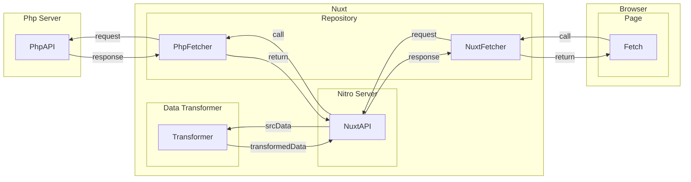

# Code Structure

## Basic Structure diagram



## Article Components Relationship Diagram

The following is the relationship between each article related components:

```mermaid
flowchart TB
  ArticlePage("ArticlePage ('/src/pages/article/[id].vue')") --> ArticleOuterLayer["ArticleOuterLayer.vue"]

  ArticleOuterLayer --> ArticleMiddleLayer["ArticleMiddleLayer.vue"]
  ArticleOuterLayer --> ArticleMeta["ArticleMeta.vue Meta Setting"]

  ArticleMiddleLayer --> ArticleInnerLayer["ArticleInnerLayer.vue"]
  ArticleMiddleLayer --> BreadCrumb["BreadCrumb.vue"]

  ArticleMiddleLayer --> VideoWrapper(["VideoWrapper.vue"])
  VideoWrapper --> VideoSide(["VideoSide.vue Sidebar"])

  ArticleInnerLayer --> ArticleContent["ArticleContent.vue"]
  ArticleInnerLayer --> ArticleSide["ArticleSide.vue Sidebar]

  ArticleContent --> ArticleEditorContent["ArticleEditorContent.vue main articleHTML"]
```
