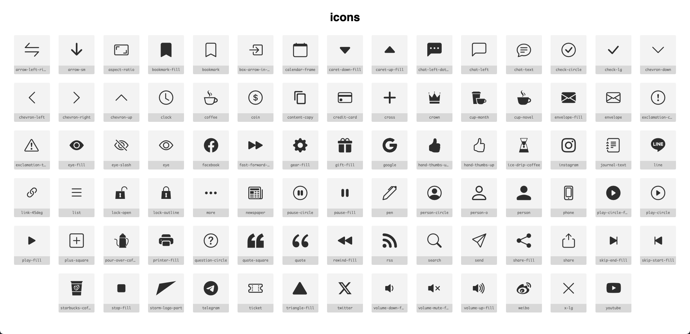

# Icon Font

SVG icon source files are stored in src/icon and converted to icon fonts using the [fantasticon](https://github.com/tancredi/fantasticon) package. These fonts are then used by the BasicIcon.vue component. For icon type definitions, please refer to [here](./data-model.md#icon-type)

## Review All Icons

To view all available icons, open `/src/assets/font/icons.html` in your browser. The preview will appear as shown below:



:::tip
If you encounter SVG issues, you can modify them directly using the [SVG Preview extension](https://marketplace.visualstudio.com/items?itemName=SimonSiefke.svg-preview) in real-time feedback. For unresolvable issues, ask UI/UX designer for help.
:::

## Add New Icon

1. Place the new icon SVG file in `src/public/icon`
2. Run the following command in the terminal:

```bash
npm run prepare-icon-font
```

After execution, the newly added icons will be available for use in `BasicIcon`.

Moreover, running the above command will generate file changes that must be committed to git:

- `src/assets/font/icons.css`
- `src/assets/font/icons.html`
- `src/assets/font/icons.json`
- `src/assets/font/icons.ttf`
- `src/assets/font/icons.woff`
- `src/assets/font/icons.woff2`
- `src/types/iconTypes.ts`
