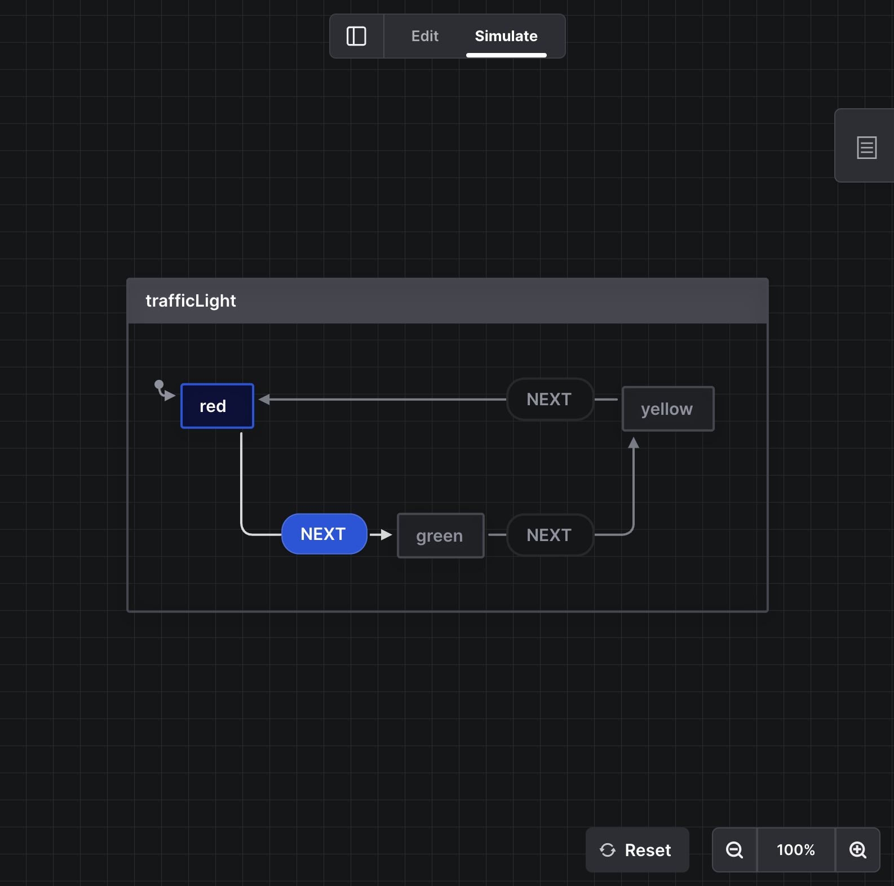

# Transaction Machine

## Design Philosophy

Frontend view transitions are inherently complex and tightly coupled with user interaction patterns. In complex scenarios—particularly checkout transaction flows—component states can become unwieldy and difficult to maintain, increasing the risk of bugs.

To address this, we implement a [Finite State Machine](https://en.wikipedia.org/wiki/Finite-state_machine) for state management. This approach strictly controls transaction flows, preventing security vulnerabilities that could emerge from out-of-sequence operations.

## Usage Scope

This project uses the [XState](https://xstate.js.org) package, a leading finite state machine implementation. We use it to manage two **complex operational** and **payment-related** workflows:

1. Membership purchase flow: "Membership Plan Payment State Machine" at `src/machines/form/memberPlanPayment.ts`
2. Donation flow: "Donation Payment State Machine" at `src/machines/form/donatePayment.ts`

:::tip
In the future, we can integrate XState into simpler operational flows to enhance maintainability
:::

## Visualization

After installing the [XState plugin](./quickstart.md#%E6%8F%92%E4%BB%B6), you can visualize the state machine as an **interactive flowchart**. This visualization helps organize and understand the entire architecture, as shown below:

## Development Principle

1. Basic development principles can be found in the [XState](https://xstate.js.org) official documentation
2. State machine scope primarily focuses on **data state**, though it may reference but is **not limited to** UI display states
3. State machines should be used only for single-page state management
4. State machines **should not** interact with Vue or Nuxt lifecycles
5. State machines **should not** perform **active redirects** (including Vue Router, Nuxt Link, or `window.location`). Such redirections are equivalent to "the state machine committing seppuku"—like a car deliberately emptying its fuel tank rather than naturally running out of gas. This makes it impossible to ensure complete process execution, unless the transaction interruption is an anticipated scenario
6. For global state (Pinia) updates, utilize the [global event](./global-event.md) `storePortalEmitter` (in `src/services/storePortalEmitter.ts`) for wormhole data transmission
