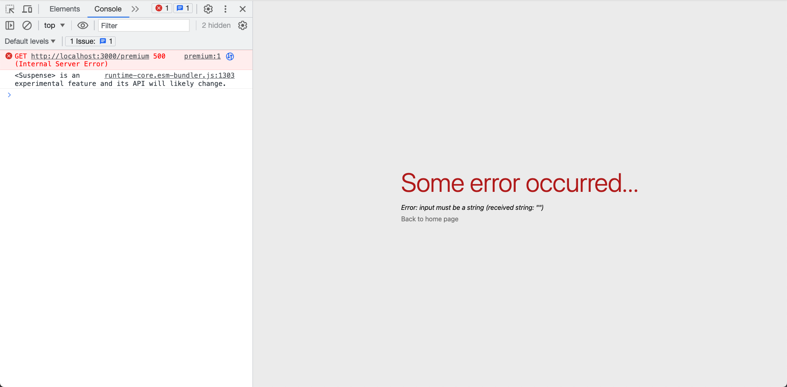
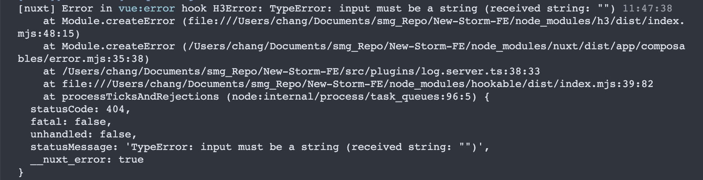

# Troubleshooting

## Component Not Imported

**Error Message**

```txt
[Vue warn]: Failed to runtime-core.esm-bundler.js:41
resolve component: Thumbnail
If this is a native custom element, make sure to exclude it from component resolution via compilerOptions.isCustomElement.
```

**Screenshot**


**Issue**

元件沒有引入

**Solution**

Run the script `npm run type-check` to identify any missing component imports.

## Error Message from vue-tsc

**Error Message**

In browser console：

```txt
[Vue warn]: Property runtime-core.esm-bundler.js:41
"premiumArticles123" was accessed during render but is not defined on instance.
```

於 terminal：

```txt
Property 'premiumArticles123' does not exist on type ' {
$: ComponentInternalInstance; $data: {}; $props: { class?: unknown; key?: string number symbol undefined; ref?: NodeRef undefined; ref for?: boolean undefined; ... 7 more ...; style?: unknown; };...
```

**Screenshot**


**Issue**

TypeScript 型別檢查有錯誤

**Solution**

執行腳本 `npm run type-check` 找出錯誤並修正

## Wrong API Route

**Error Message**

```txt
POST http://localhost: 3000/api/getArticleList123 404 (Page not found:/api/getArticleList123)
```

```txt
[nuxt] [request error] [unhandled] [404] 404 Not Found (https://localhost/api/articles/list123/channel_id/101/0,6/front_view,d
esC
```

**Screenshot**


## Wrong Tailwind Class Name

**Error Message**

```txt
[postcss] /Users/Documents/my-project/src/pages/index.vue?
vuedtype=style&index=0&scoped=8117d26d&lang.scss:2:3: The 'hello' class does not exist. If 'hello' is a custom class, make sure it is defined within a '@layer' directive.
```

**Screenshot**


**Issue**

Nonexistent tailwind class name

**Solution**

Refined to correct tailwind class

## NuxtImg Error

**Error Message**

In browser

```txt
Error: input must be a string (received string: "")
```

In terminal

```txt
TypeError: input must be a string (received string: "")
```

**Screenshot**

In browser



In terminal



**Issue**

The `src` attribute inside `<NuxtImg />` is an **empty string**

**Solution**

Check if any `<NuxtImg />`'s `src` attributes might contain empty strings, and use `v-if` to prevent such cases

```html
<NuxtImg v-if="imgSrc" v-bind:src="imgSrc" />
```

:::danger
The error message lacks clarity, making it challenging to identify the problematic NuxtImg component. Since `vue-tsc` cannot detect this issue, the best approach is to examine recently modified sections of code.
:::
